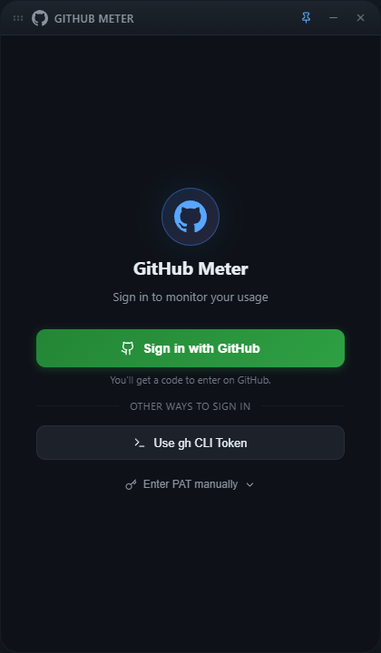
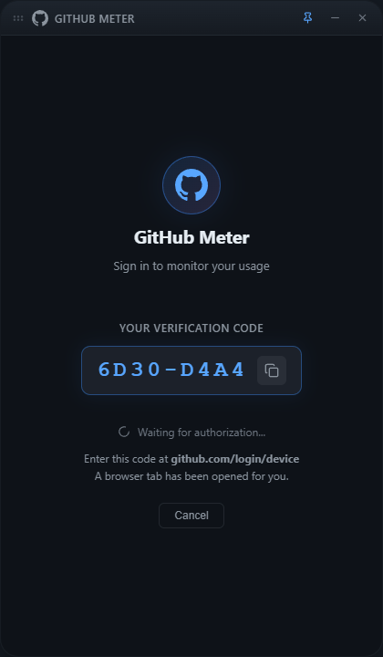
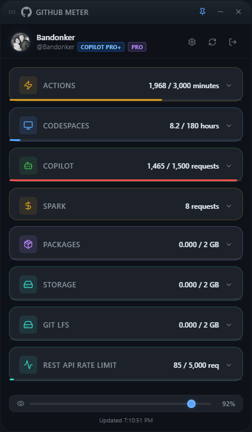
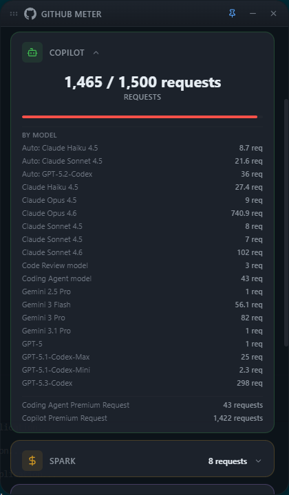
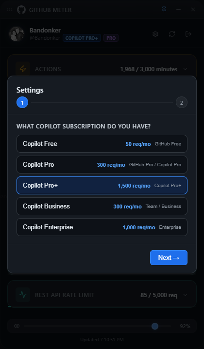
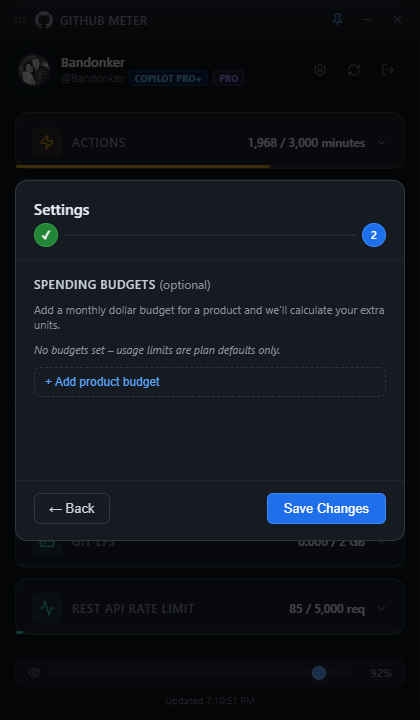

# GitHub Meter

[](https://github.com/Bandonker/githubMeter/releases/latest)
[](LICENSE)
[](#download)

A lightweight, always-on-top desktop widget built with **Tauri v2 + React + TypeScript** that monitors your GitHub metered usage in real time — Copilot requests, Actions minutes, Packages bandwidth, storage, and API rate limits.

---

## Screenshots

<table>
  <tr>
    <td align="center"><b>Sign in</b></td>
    <td align="center"><b>Device Flow auth</b></td>
    <td align="center"><b>Dashboard</b></td>
  </tr>
  <tr>
    <td align="center"></td>
    <td align="center"></td>
    <td align="center"></td>
  </tr>
  <tr>
    <td align="center"><b>Copilot model breakdown</b></td>
    <td align="center"><b>Settings</b></td>
    <td align="center"><b>Spending budgets</b></td>
  </tr>
  <tr>
    <td align="center"></td>
    <td align="center"></td>
    <td align="center"></td>
  </tr>
</table>

---

## Download

Pre-built installers are available on the [Releases](https://github.com/Bandonker/githubMeter/releases/latest) page.

| Platform | Download |
|----------|----------|
| Windows | `.msi` installer |
| macOS (Apple Silicon) | `.dmg` |
| macOS (Intel) | `.dmg` |
| Linux | `.AppImage` / `.deb` |

> **macOS note:** The app is not notarized. On first launch, right-click → Open to bypass the Gatekeeper warning.

---

## Features

- **Copilot Premium Requests** — usage vs plan quota with per-model breakdown (GPT-5.3 Codex, Claude, Gemini, etc.)
- **Copilot Plan Detection** — auto-detects Free / Pro / Pro+ / Business / Enterprise from billing SKUs
- **Actions & CI Minutes** — total/paid minutes with per-OS breakdown (Linux, macOS, Windows)
- **Packages Bandwidth** — data transfer used vs included quota
- **Shared Storage / Git LFS** — storage usage with paid overage
- **REST API Rate Limit** — requests used/remaining with reset countdown
- **Spending Budgets** — configure per-product monthly budgets to calculate extra units
- **Secure Authentication**
  - GitHub Device Flow (recommended — one click, no PAT pasting)
  - `gh` CLI token fallback (`gh auth login`)
  - Manual PAT entry as last resort
  - Tokens stored in OS keyring — never in files or localStorage
- **Always-on-Top** — pin/unpin to stay visible while you work
- **Transparency Slider** — adjust window opacity from 10% to 100%
- **Auto-Resize** — window height adjusts to content automatically
- **Auto-Refresh** — polls every 5 minutes; manual refresh button

---

## Build from Source

### Prerequisites

| Tool | Version |
|------|---------|
| [Node.js](https://nodejs.org/) | 18+ |
| [Rust](https://rustup.rs/) | stable |
| [Tauri CLI v2](https://tauri.app/start/) | v2 |

**Windows** also requires the [WebView2](https://developer.microsoft.com/en-us/microsoft-edge/webview2/) runtime (pre-installed on Windows 10 1803+).

**Linux** requires:
```bash
sudo apt-get install libwebkit2gtk-4.1-dev libappindicator3-dev librsvg2-dev patchelf libdbus-1-dev
```

### Run

```bash
git clone https://github.com/Bandonker/githubMeter.git
cd githubMeter
npm install
npm run tauri dev
```

### Build installer

```bash
npm run tauri build
# Installer appears in src-tauri/target/release/bundle/
```

---

## Authentication

On first launch you'll see a sign-in screen with three options:

1. **Sign in with GitHub** — click the button, copy the code shown, and enter it at `github.com/login/device`. The app polls automatically and logs you in.
2. **Use gh CLI Token** — if you already have `gh auth login` configured.
3. **Enter Token Manually** — paste a PAT with `user`, `read:org` scopes.

Tokens are stored in your OS keyring and restored on next launch.

---

## GitHub APIs Used

| Endpoint | Purpose |
|----------|---------|
| `GET /user` | User profile and GitHub plan |
| `GET /users/{user}/settings/billing/usage/summary` | Enhanced Billing: Actions, Packages, Storage, Copilot aggregate |
| `GET /users/{user}/settings/billing/premium_request/usage` | Per-model Copilot premium request breakdown |
| `GET /rate_limit` | REST API rate limit status |

---

## Configuration

| Setting | Location | Default |
|---------|----------|---------|
| Window size | `src-tauri/tauri.conf.json` | 420 × 720 |
| Always on top | Title bar pin button | On |
| Opacity | Footer slider | 92% |
| Refresh interval | `Dashboard.tsx` | 5 min |
| Copilot plan | Auto-detected / Settings modal | Auto |
| Spending budgets | Settings modal | None |

---

## Project Structure

```
githubMeter/
├── src/                      # React frontend
│   ├── components/           # TitleBar, Dashboard, LoginScreen, MeterCard, SetupModal
│   ├── styles/               # Global CSS variables and design tokens
│   ├── api.ts                # Tauri IPC invoke wrappers
│   ├── config.ts             # localStorage config persistence
│   └── types.ts              # TypeScript type definitions
├── src-tauri/                # Rust backend
│   ├── src/lib.rs            # Tauri commands: auth, billing API, Copilot plan detection
│   ├── capabilities/         # Tauri v2 permission manifest
│   ├── Cargo.toml            # Rust dependencies
│   └── tauri.conf.json       # App window and bundle settings
├── .github/
│   ├── workflows/            # CI and release GitHub Actions
│   └── ISSUE_TEMPLATE/       # Bug report and feature request forms
└── package.json
```

---

## Tech Stack

| Layer | Technology |
|-------|-----------|
| Desktop runtime | Tauri v2 |
| Frontend | React 19 + TypeScript + Vite 7 |
| Styling | CSS Modules + CSS custom properties |
| Icons | Lucide React |
| HTTP client | reqwest (Rust) |
| Token storage | keyring crate (OS credential manager) |
| Auth | GitHub Device Flow (OAuth 2.0 RFC 8628) |

---

## Contributing

Pull requests are welcome. Please open an issue first to discuss significant changes.

1. Fork the repo and create a branch from `main`.
2. Make your changes — run `npx tsc --noEmit` and `cargo check` before pushing.
3. Open a PR using the provided template.

---

## License

[PolyForm Noncommercial 1.0.0](LICENSE) — free for personal and open-source use. Commercial use requires a separate agreement.
